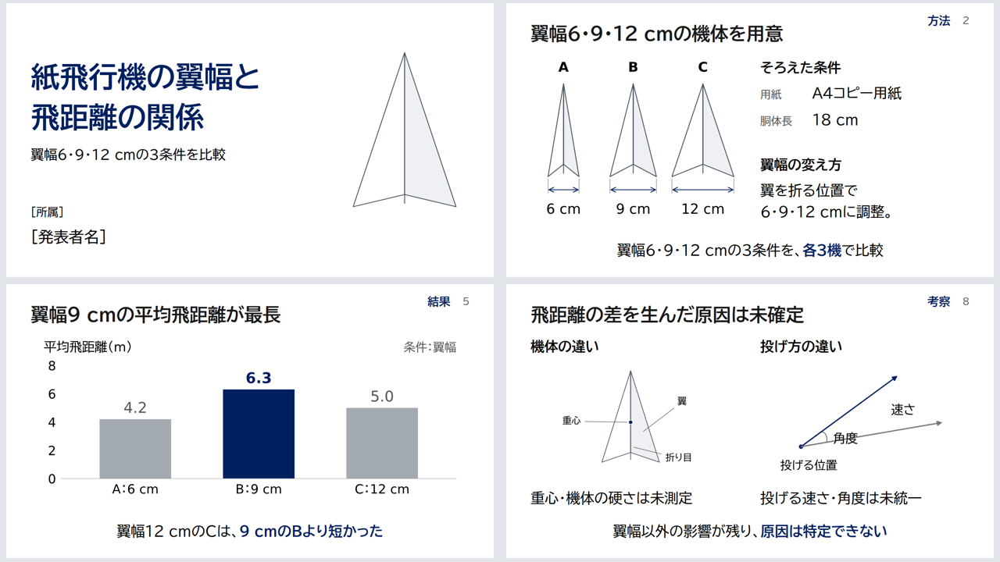

# My Slidev Template

私の発表スライド用のSlidevテンプレートです。

`slides.md` は、紙飛行機の研究発表を例にした表紙込み全11枚の完成見本です。実験条件・寸法・測定値は見本用の架空の設定です。
翼幅（左右の翼端間の幅）を6・9・12 cmに設定し、仮説を立てた理由から比較方法・結果へ進みます。考察ではそろえきれなかった条件を示し、発射条件・重心をそろえて同じ3条件を再比較する計画につなぎます。

- 1枚1トピック。具体的な見出し、図表と短い説明、研究内容に即した締めの一文を置く。
- 本文は最大10行・箇条書き5項目を目安にし、1分以内で説明できる量に絞る。補足は発表者ノートへ。
- 本文と下部の結論は28pt相当を基本にする。白地に黒と濃紺を使い、見出し・本文は左揃え、下部の結論は中央揃えにする。
- 「背景」「目的」などの章名は濃紺の太字にし、右上のページ番号の隣に置く。
- 強調は重要な語句や結果に絞る。図表のラベルは対象の近くに置き、補助線や枠線を減らす。
- 図を見れば分かる説明は口頭で補い、必要な補足は発表者ノートに置く。
- 短い比較は図式で大きく示す。予想と結果は同じ順序で並べ、対応関係を読み取りやすくする。
- 導入が細切れになる場合は背景・目的をまとめる。内容の量に応じて図表と文字の大きさを調整し、説明を表示領域に合わせて配置する。
- 機体ごとの結果は1機1点で表示する。平均値の範囲と個々の試行のばらつきを混同しない。
- 比較する量を寸法と単位で示す。結果から言える範囲を守り、追加実験を最初の問いにつなげる。

参考にしたページと、見本に反映した内容：

| 参考ページ | 反映した内容 |
| :--- | :--- |
| [発表の構成](https://student.tsutawarudesign.com/story/) | 背景から研究の問いへつなぎ、考察で答える |
| [タイトルスライド](https://student.tsutawarudesign.com/title_slide/) | 左揃えと、タイトル・副題・発表者の大きさの差 |
| [スライドのデザイン](https://student.tsutawarudesign.com/slide_design/) | 色と書体を統一し、強調を限定する |
| [コンテンツスライド](https://student.tsutawarudesign.com/contents_slide/) | 図表を中心に配置し、関係の近い情報をまとめる |
| [表とグラフ（親サイト）](https://tsutawarudesign.com/miyasuku1.html) | 棒の枠線を外し、値を直接表示。個体差は点で比較する |
| [レイアウト（親サイト）](https://tsutawarudesign.com/miyasuku4.html) | 図表・説明の間に余白を確保し、共通の位置に揃える |
| [文字組み（親サイト）](https://tsutawarudesign.com/yomiyasuku4.html) | 短い行、意味のまとまりでの改行、読み始めの位置を統一 |

[全11枚の一覧画像](docs/overview.png) · [各ページのPNG](docs/slides/)

`npm run dev` で表示、`npm run export` でPDFに出力できます。白紙から作る場合は `starter.md` を使います。

図の元データとSVGは `public/media/` にあります。図を再生成する場合は、Matplotlibのある環境で `python3 scripts/render-paper-airplane-figures.py` を実行します。
棒グラフは0〜8 mの軸で比較し、機体ごとの点のグラフは3〜7.5 mの範囲で差を詳しく示しています。
